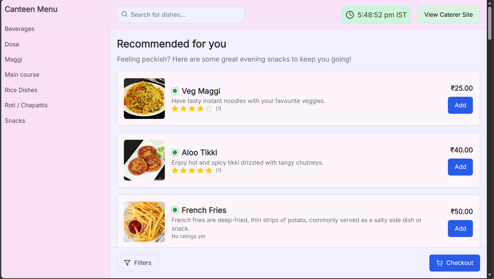
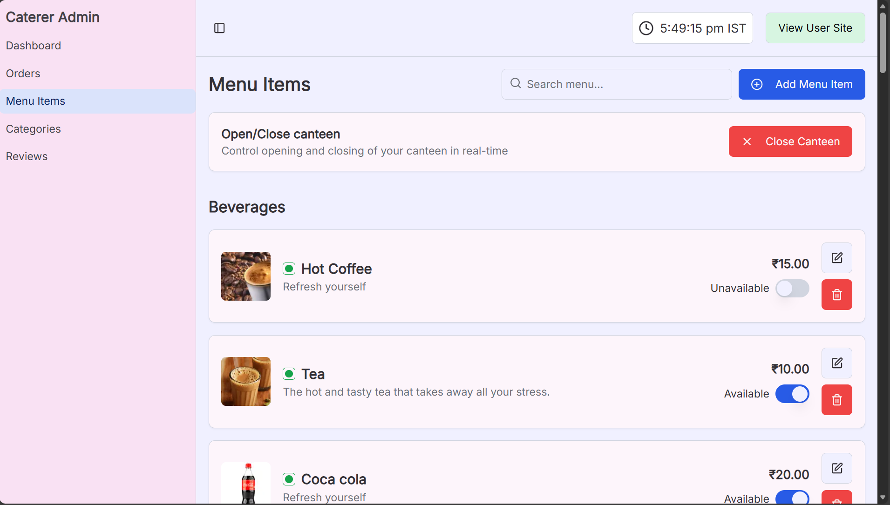
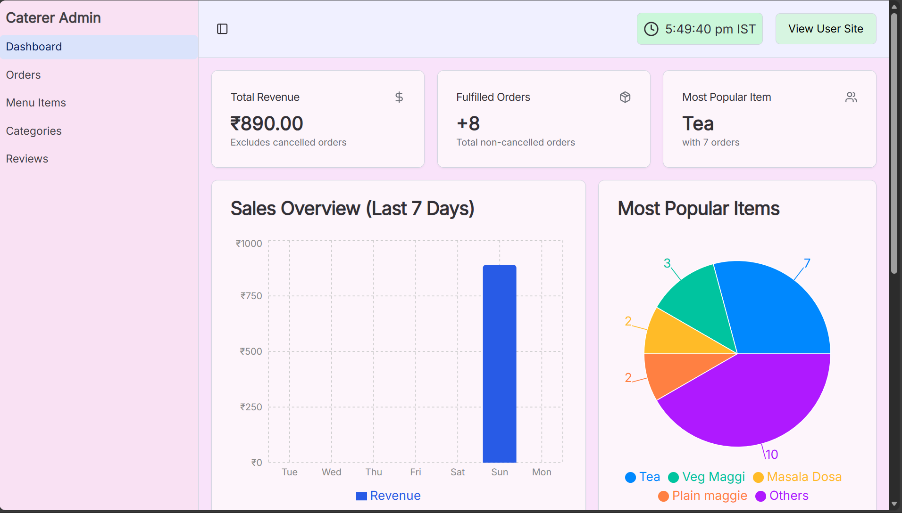
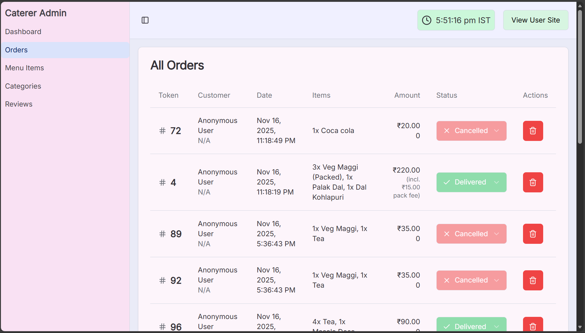
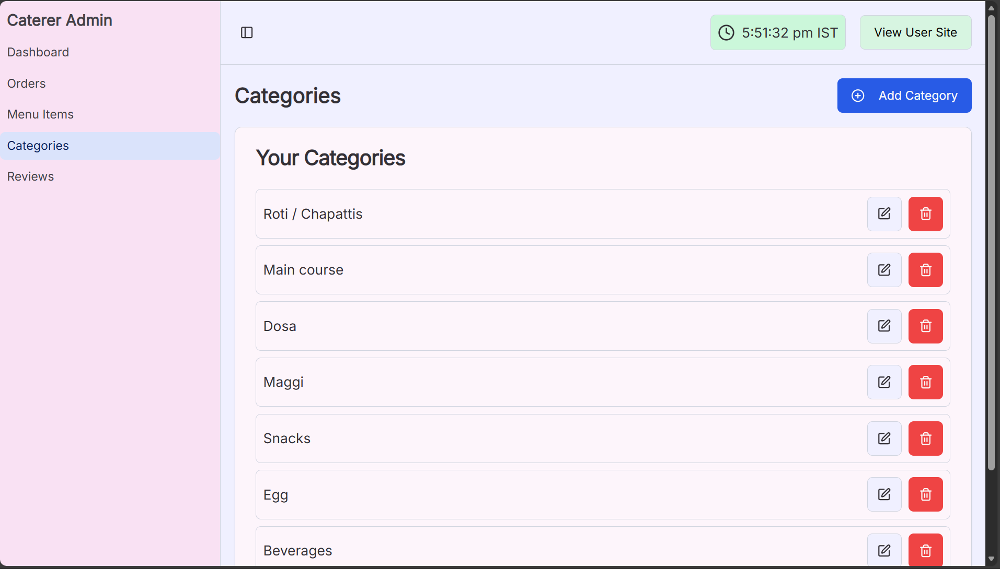
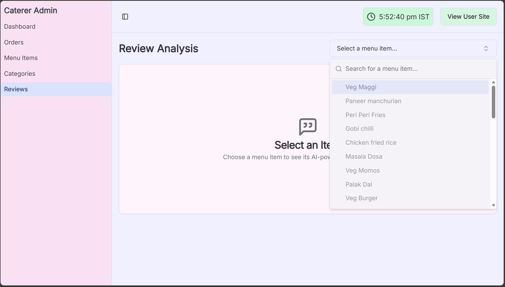

# 🍽 AI-Powered Canteen Management System

An intelligent and efficient web application for *canteen management* — featuring AI-powered meal recommendations, real-time order processing, and comprehensive analytics — *through intuitive visualization and seamless user experience*.

🎯 *GitHub Repository:*  
👉 [https://github.com/NITISHNAVEEN/AI-Powered-Canteen-Management-Sysytem.git](https://github.com/NITISHNAVEEN/AI-Powered-Canteen-Management-Sysytem.git)

*Live Demo:*
👉[Live Demo Link](https://studio--foodie-s-hub-9d2bc.us-central1.hosted.app/)
---

<p align="center">
  
   
   
   
   
   
</p>

---

Built using *Next.js, **Tailwind CSS, **JavaScript, **Google Gemini LLM, and **Firebase Realtime Database, this project transforms traditional canteen operations into a **smart, data-driven, and customer-centric system*. 🍔🤖📊

---

## 🧑‍💻 Team Members

| Name | Roll No. | Contributions |
|------|-----------|----------------|
| *Anchal Jaiswal* | 24BDS003 | Designed the complete user interface and user experience. Implemented the customer ordering flow with filter system and packaging options. Created the feedback and review system interface. Also, did entries of dishes to application from real canteen at IIIT Dharwad|
| *Chandan Kumar* | 24BDS013 | Developed the AI-powered meal recommendation engine using Google Gemini LLM. Integrated Firebase Realtime Database for real-time synchronization. Implemented the token management system (1-100 circular queue).  Created Report and Readme.md file|
| *Nitish Naveen* | 24BDS050 | Built the caterer dashboard with order management and analytics features. Implemented the most sold dishes analytics combining sales and reviews. Developed the dynamic menu management system and packaging charge functionality. Worked on git operations and presentations |

---

## 🧰 Tech Stack

| Technology | Purpose |
|-------------|----------|
| *Next.js* | React-based framework for server-side rendering and optimal performance |
| *JavaScript* | Primary development language for frontend and backend logic |
| *Tailwind CSS* | Utility-first CSS framework for responsive and modern UI design |
| *Google Gemini LLM* | AI-powered meal recommendations based on time and context |
| *Firebase Realtime Database* | NoSQL database for real-time data synchronization |
| *Vercel* | Deployment and hosting platform |

---

## 🚀 Features

### For Customers 👥
- 🍕 *Browse Menu* with real-time availability updates
- 🤖 *AI Meal Recommendations* based on time of day (breakfast, lunch, snacks, dinner)
- 🔍 *Advanced Filtering* by price range and dietary type (vegetarian/non-vegetarian)
- 📦 *Packaging Option* with transparent 5 rupee additional charge
- 🎟 *Token-Based Order Tracking* (1-100 reusable tokens)
- ⭐ *Feedback System* to rate food quality, service speed, and overall experience
- 📱 *Real-Time Order Status Updates* without page refresh

### For Caterers 👨‍🍳
- 📋 *Order Queue Management* with real-time notifications
- 🎫 *Token Assignment System* for efficient order collection
- 📊 *Revenue Dashboard* with real-time financial analytics
- 🏆 *Most Sold Dishes* analytics combining sales volume and customer reviews
- 🍽 *Dynamic Menu Management* - add/remove items instantly
- 🔄 *Operational Control* - toggle canteen open/closed status
- 💰 *Packaging Revenue Tracking* with adoption metrics
- ⭐ *Customer Feedback Analysis* for continuous improvement

---

## 🎯 Key Functionalities

### 🔄 Token Management System
- *Circular Queue Implementation*: Tokens numbered 1-100 that automatically recycle
- *Real-Time Allocation*: Next available token assigned when order is ready
- *Instant Reusability*: Tokens return to pool after order collection
- *Clear Communication*: Simple numeric identifiers for easy order pickup

### 🤖 AI-Powered Recommendations
- *Time-Aware Suggestions*: Different recommendations for morning, afternoon, evening, and night
- *Context Analysis*: Google Gemini LLM analyzes current menu and time context
- *Smart Prioritization*: Displays relevant items while allowing full menu access
- *Graceful Degradation*: System works without AI if service is unavailable

### 🔍 Filter System
- *Price Filtering*: Low, Medium, High, or Custom price ranges
- *Dietary Preferences*: Vegetarian and Non-Vegetarian options
- *JavaScript Implementation*: Client-side filtering for instant results
- *Combined Filters*: Multiple criteria for specific searches (e.g., "vegetarian under 100 rupees")
- *Performance*: 40% faster order completion with filters enabled

### 📦 Packaging & Pricing
- *Optional Takeaway*: Customers can select packaging during checkout
- *Fixed Charge*: 5 rupee additional charge for packaging
- *Transparent Display*: Charge shown before order confirmation
- *Itemized Receipts*: Separate line item for packaging in order summary
- *Analytics Tracking*: 35% adoption rate monitored in dashboard

### ⭐ Feedback & Review System
- *Multi-Dimensional Ratings*: Food quality, service speed, and overall experience (1-5 stars)
- *Textual Comments*: Up to 500 characters for detailed feedback
- *Order Association*: Feedback linked to specific orders and menu items
- *Real-Time Analytics*: Immediate aggregation for dashboard display
- *Continuous Improvement*: Data-driven menu optimization

### 📊 Most Sold Dishes Analytics
- *Combined Metrics*: Sales volume + customer ratings
- *Multi-Criteria Ranking*: Total orders, revenue, average rating, positive reviews
- *Visual Presentation*: Bar charts and ranking tables
- *Actionable Insights*: Identify items for quality improvement or promotion
- *Real-Time Updates*: Instant reflection of new orders and reviews

### 🤖 AI Powered Review Analysis for Caterer
- *Positive Feedback*: Analyzes all the reviews and summarizes all positives in them for each dish
- *Negative Feedback*: Summarizes negatives from all the reviews for specific dish
- *Suggestions*: Provide suggestions on how to improve negatives to boost sales

---

## 🎯 System Workflow

### Customer Journey
1. *Browse Menu* → Filter by price/dietary preference
2. *View AI Recommendations* → Based on current time
3. *Select Items* → Add to cart with quantities
4. *Choose Packaging* → Optional 5 rupee charge
5. *Place Order* → Enters caterer's queue (Pending status)
6. *Receive Token* → Number between 1-100 (when Processing)
7. *Track Status* → Real-time updates (Processing → Completed)
8. *Collect Order* → Using token number
9. *Provide Feedback* → Rate and review experience

### Caterer Workflow
1. *View Order Queue* → New orders appear instantly
2. *Update Status* → Pending → Processing
3. *Assign Token* → Next available from pool (1-100)
4. *Prepare Food* → Based on order details
5. *Mark Complete* → Customer notified for collection
6. *Monitor Analytics* → Revenue, most sold dishes, feedback
7. *Manage Menu* → Add/remove items dynamically
8. *Control Operations* → Toggle canteen open/closed

---

## 🧩 Project Structure

```text
Canteen-Management-System/
│
├── docs/                    # Project documentation & guides
├── node_modules/            # Dependencies
│
├── public/                  # Static assets
│   ├── customer-demo.mp4    # Customer interface demo video
│   ├── caterer-demo.mp4     # Caterer dashboard demo video
│   └── icons/               # App icons and images
│
├── src/                     # Application source code
│   ├── ai/                  # AI logic & Gemini integration
│   ├── app/                 # Next.js App Router (Pages & Layouts)
│   │   ├── customer/        # Customer-facing routes
│   │   └── caterer/         # Caterer-facing routes
│   │
│   ├── components/          # Reusable React components
│   │   ├── customer/        # Customer specific components
│   │   ├── caterer/         # Caterer specific components
│   │   └── ui/              # Shared UI elements (buttons, inputs)
│   │
│   ├── context/             # React Context (Global state management)
│   ├── firebase/            # Firebase configuration & setup
│   ├── hooks/               # Custom React hooks
│   └── lib/                 # Utility functions
│
├── .env                     # Environment variables
├── .gitignore               # Git ignore rules
├── apphosting.yaml          # Firebase App Hosting configuration
├── components.json          # UI component library config
├── firestore.rules          # Firebase Firestore security rules
├── next.config.ts           # Next.js configuration
├── package.json             # Dependencies and scripts
├── postcss.config.mjs       # PostCSS configuration
├── tailwind.config.ts       # Tailwind CSS configuration
├── tsconfig.json            # TypeScript configuration
└── README.md                # Project documentation
```


---

## ⚙ Installation & Setup

### Prerequisites
- Node.js (v16 or higher)
- npm or yarn
- Firebase account
- Google Gemini API key

### Clone the repository

bash

git clone https://github.com/NITISHNAVEEN/AI-Powered-Canteen-Management-System.git

cd AI-Powered-Canteen-Management-System


### Install dependencies

bash

npm install

# or

yarn install


### Configure environment variables

Create a .env.local file in the root directory:

env
# Firebase Configuration
NEXT_PUBLIC_FIREBASE_API_KEY=your_firebase_api_key
NEXT_PUBLIC_FIREBASE_AUTH_DOMAIN=your_project.firebaseapp.com
NEXT_PUBLIC_FIREBASE_DATABASE_URL=https://your_project.firebaseio.com
NEXT_PUBLIC_FIREBASE_PROJECT_ID=your_project_id
NEXT_PUBLIC_FIREBASE_STORAGE_BUCKET=your_project.appspot.com
NEXT_PUBLIC_FIREBASE_MESSAGING_SENDER_ID=your_sender_id
NEXT_PUBLIC_FIREBASE_APP_ID=your_app_id

# Google Gemini API
NEXT_PUBLIC_GEMINI_API_KEY=your_gemini_api_key
Visit aistudio.google.com for gemini api key and use it in .env

### Run the development server

bash

npm run dev

# or

yarn dev


### Open in browser


http://localhost:3000


---

## 📊 Database Schema

### Firebase Realtime Database Collections

#### Orders Collection

javascript
{
  orderId: "order_123",
  customerInfo: {...},
  items: [...],
  status: "pending" | "processing" | "completed" | "closed",
  tokenNumber: 42,
  packaging: true,
  packagingCharge: 5,
  totalAmount: 250,
  timestamp: "2024-01-15T10:30:00Z"
}


#### Menu Collection

javascript
{
  dishId: "dish_001",
  name: "Vegetable Biryani",
  description: "Aromatic rice with mixed vegetables",
  price: 120,
  category: "lunch",
  dietaryType: "vegetarian",
  available: true,
  createdAt: "2024-01-01T00:00:00Z"
}


#### Tokens Collection

javascript
{
  tokenNumber: 42,
  status: "active" | "available",
  orderId: "order_123",
  assignedAt: "2024-01-15T10:35:00Z"
}


#### Feedback Collection

javascript
{
  feedbackId: "feedback_123",
  orderId: "order_123",
  ratings: {
    foodQuality: 5,
    serviceSpeed: 4,
    overall: 5
  },
  comments: "Great food and quick service!",
  timestamp: "2024-01-15T11:00:00Z"
}


---

## 🎨 UI Components

### Customer Interface
- *Menu Browser*: Grid/list view with item cards
- *Filter Panel*: Price sliders and dietary checkboxes
- *AI Recommendation Banner*: Highlighted suggested items
- *Cart*: Real-time total with packaging option
- *Order Tracker*: Status timeline with token display
- *Feedback Form*: Star ratings and comment box

### Caterer Dashboard
- *Order Queue*: Real-time list with status badges
- *Token Manager*: Visual token pool (1-100)
- *Analytics Charts*: Revenue graphs, order volume, trends
- *Most Sold Dishes*: Ranked list with sales and ratings
- *Menu Manager*: Add/edit/delete items interface
- *Operational Toggle*: Open/closed status switch

---

## 📈 Results & Performance

- ⚡ *40% Faster Ordering*: With filter system enabled
- 📦 *35% Adoption Rate*: For packaging option
- 🎯 *Real-Time Sync*: Zero-delay order updates
- ⭐ *High User Satisfaction*: Through continuous feedback integration
- 📊 *Data-Driven Decisions*: Most sold dishes analytics
- 🔄 *Efficient Queue*: Circular token system (1-100)

---

## 🔮 Future Enhancements

- 💳 *Payment Integration*: Cashless transactions with UPI, cards
- 👤 *User Accounts*: Order history and personalized recommendations
- 📱 *Mobile Apps*: Native iOS and Android applications
- 🔔 *Push Notifications*: Order status updates and special offers
- 📊 *Advanced Analytics*: Demand forecasting and waste reduction
- 🏪 *Inventory Management*: Automatic availability updates
- 📸 *QR Code System*: Scan tokens for collection
- 🎁 *Loyalty Programs*: Rewards based on orders and reviews
- 🌐 *Multi-Language Support*: Regional language options

---

## 🤝 Contributing

Contributions are welcome! Please follow these steps:

1. Fork the repository
2. Create a feature branch (git checkout -b feature/AmazingFeature)
3. Commit your changes (git commit -m 'Add some AmazingFeature')
4. Push to the branch (git push origin feature/AmazingFeature)
5. Open a Pull Request

---

## 📞 Contact & Support

For questions, suggestions, or issues:

- *GitHub Issues*: [Report a bug](https://github.com/NITISHNAVEEN/AI-Powered-Canteen-Management-Sysytem.git)
- *Email*: team@iiitdwd.ac.in.com

---

## 🙏 Acknowledgments

- *IIIT Dharwad* for providing resources and support
- *Dr. Animesh Chaturvedi* for guidance on the project
- *Google Gemini* for AI recommendation capabilities
- *Firebase* for real-time database infrastructure
- *Next.js* and *Tailwind CSS* communities for excellent documentation

---

## 💡 Authors

*Team Canteen Innovators*

Built with ❤ using Next.js, JavaScript, Tailwind CSS, Google Gemini LLM, and Firebase Realtime Database.

---

[](https://github.com/NITISHNAVEEN/AI-Powered-Canteen-Management-Sysytem.git)
[](https://github.com/NITISHNAVEEN/AI-Powered-Canteen-Management-Sysytem.git)
[](https://github.com/NITISHNAVEEN/AI-Powered-Canteen-Management-Sysytem.git)
[](https://github.com/NITISHNAVEEN/AI-Powered-Canteen-Management-Sysytem.git)

---

*⭐ If you find this project helpful, please consider giving it a star on GitHub!*
